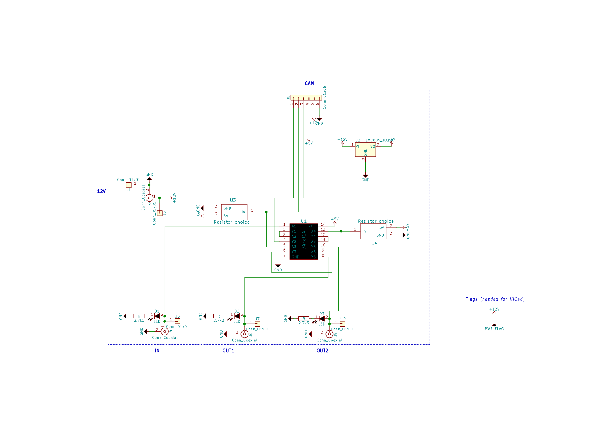
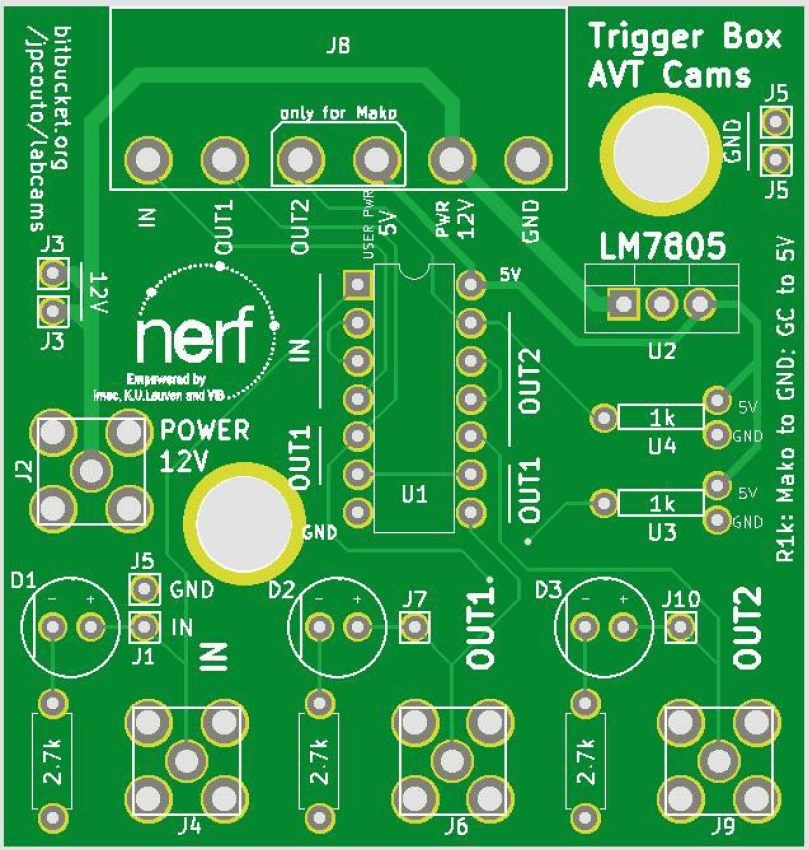

## Camera specific instructions

# PCO Edge

### Installing drivers and connecting the camera

This camera only works in windows.

Install the PCO.sdk software; make sure to install the correct adapter for your camera (e.g. CameraLink if you have a frame grabber). Install to one of the locations below.

labcams searches for the drivers in:

 * C:\Program Files (x86)\pco\pco.sdk\bin64\SC2_Cam.dll
 * C:\Program Files (x86)\Digital Camera Toolbox\pco.sdk\bin64\SC2_Cam.dll or
 * C:\Program Files (x86)\PCO Digital Camera Toolbox\pco.sdk\bin64\SC2_Cam.dll

Because the camera needs to be initialized, you need to open the camera with Camware before opening with ``labcams``. This needs to be done everytime you restart the computer or change the size of the sensor.

### Connections for widefield imaging using a teensy for sync and alternate illumination

For fast one photon imaging with the PCO camera you want to use the camera in rolling shutter mode. To do this light needs to be ON only during the exposure time common to all lines. These options need to be set in camware.

You can use a teensy to record sync pulses from behavior or stimulus. There are a couple of examples in the duino folder.

# FLIR cameras

### Installing drivers and connecting the camera

Download SpinView **both the instalation .exe and the python files**. 

**WARNING** Do not do ``pip install pyspin`` the pyspin package in the PyPi project is not the same as the SpinView Python drivers.

* Install the exe
* To install for python you need to download the correct  version for your python instalation (from the FLIR SpinView website).
* Extract the zip and run ``pip install spinnaker_python-2.0.0.147-cp38-cp38-win_amd64.whl`` from the extracted folder (assuming you are using python 3.8).

### Connections for syncronization

To record in sync with behavior you need to connect a **sync TTL** (this from behavior or stimulation hardware) to the pins of the camera. 

On the Chamaeleon 3 USB you can use the Purple wire (GPIO 2). The GPIO states are recorded to the log file and you can use those to sync. 

Make sure the sync pulse is longer than the duration of an individual frame otherwise the camera might miss it.  

# Allied Vision Technologies cameras (AVT):

### Installing drivers and connecting cameras:

* Vimba drivers
* Pymba
* Jumbo packets
* Cable connections and diagram 
     general (camera, computer,ethernet,triggering box)
Connect the Ethernet cable to your computer.
Typically, Vimba Viewer recognizes the camera, but you can not record.
If this is the case then you have to change your IP address. 
On Windows: Control Panel -> Network & Internet -> Network connections -> right-click Ethernet -> Properties -> Networking: Select IPv4 -> Properties -> Use the following IP address. Then change it to a value close to the one of the camera (accessible in the Vimba Viewer in the �information� tab on the right). In my case I used 168.254.100.0 for the IP address and 255.255.0.0 for the subnet mask.

##### Connections for the GC camera

We are only using the first 5 pins of the camera.

Camera Signal|Wire Color|Trigger box pin
------------ | -------- | --------------
Camera GND|Blue|GND
Camera Power|Red|PWR 12V
In 1| Pink|IN
Out 1|Gray|OUT1
Isolated IO GND|Yellow|GND

GC Hirose HR10A-10R-12PB connector [Complete table](images/gc_conn.png)
 
##### Connections for the Mako

We are using 7 pins of the camera (all except Out3).

Camera Signal|Wire Color|Trigger box pin
------------ | -------- | --------
Out 1|Yellow dot Red|OUT1
Out 2|Yellow dot Black|OUT2
In 1|Grey dot Black|IN
Isolated In GND|Pink dot Black|GND
Isolated Out Power|Pink dot Red|USER PWR 5V
Camera power|Orange dot Black|PWR 12V
Camera GND|Orange dot Red|GND

Mako Hirose HR25-7TR-8PA(73) connector [Complete table](images/mako_conn.png)

# Triggering box
The triggering box  has been tested with AVT cameras mostly. It can be used to
   - power cameras;
   - access the camera output
   - trigger cameras with TTL signals.

It uses a schmitt trigger for normalizing the outputs

#### Circuit diagram

Power is on the left, camera interface on top and Arduino interface on bottom.
Only 2 outputs are used: the GC can only use 1, and while the Mako can use up to 3, there is no likely scenario where 3 outputs are needed.

The two main components of the board are the 74HCT14 (Hex Inverter with Schmitt trigger) and the LM7805 (Voltage regulator which outputs 5V).
We only want the Hex Inverter to put the signals to 5V, without inverting, so we invert the signals twice.
The LM7805 is used instead of a voltage divider because it will still supply 5V with a 24V input (it will overheat), allowing a potentially connected Arduino board to survive.

##### Printed circuit board (PCB)

Schematics and PCB were done in KiCad ([Design files](pcb/)). The initial version of the PCB was designed by Adrian Philippon at NERF.

* There is an indicator LED for each trigger connection.
* The 1k resistors (U3 and U4) are the pull up/down resistors for the camera outputs, and can be connected either to 5V (for the AVT GC) or GND (for the AVT Mako).
* Some pins are repeated (e.g. 12V, GND) to allow juxtaposition of several trigger boxes. This allows several boards to share the same power supply and trigger source.
* The two holes are M6.

